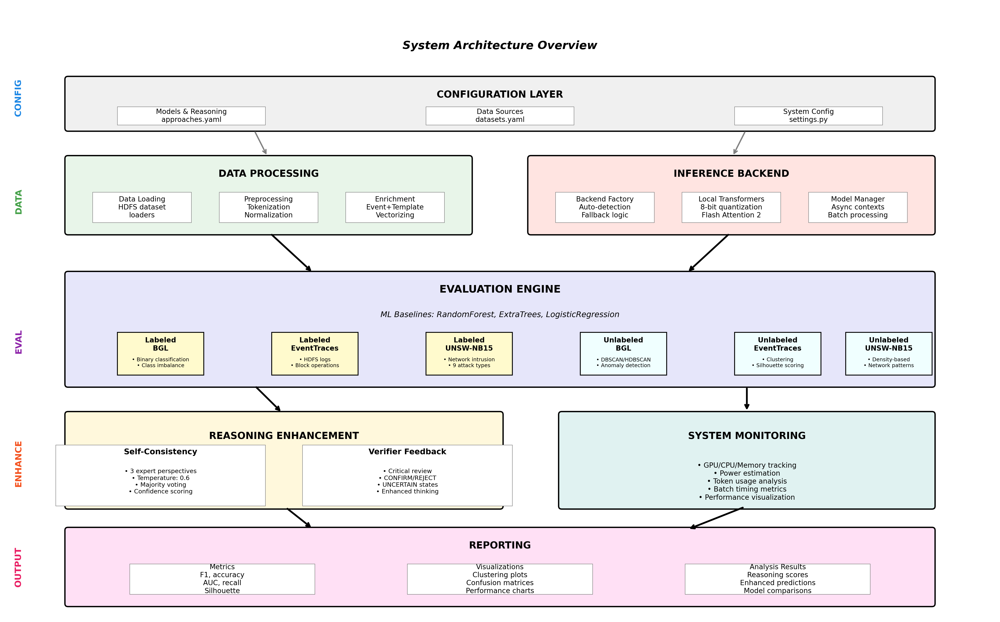

# SCARLOG - Self-Consistent Anomaly Reasoning for Logs

## Overview

SCARLOG (Self-Consistent Anomaly Reasoning for Logs) is a research project for evaluating log anomaly detection with reasoning capabilities, featuring:

- Modular architecture
- Multiple inference backends
- Comprehensive testing via multiple language models
- Configuration management

  

## Getting Started

Benchmark scripts (test, small, large) are provided in the `benchmarks/` directory.   
